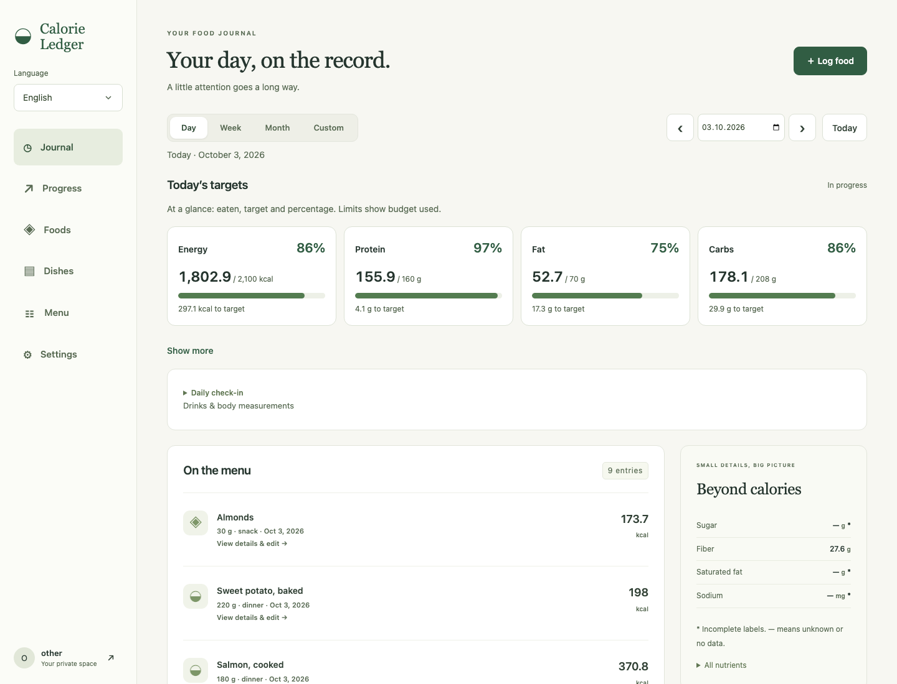
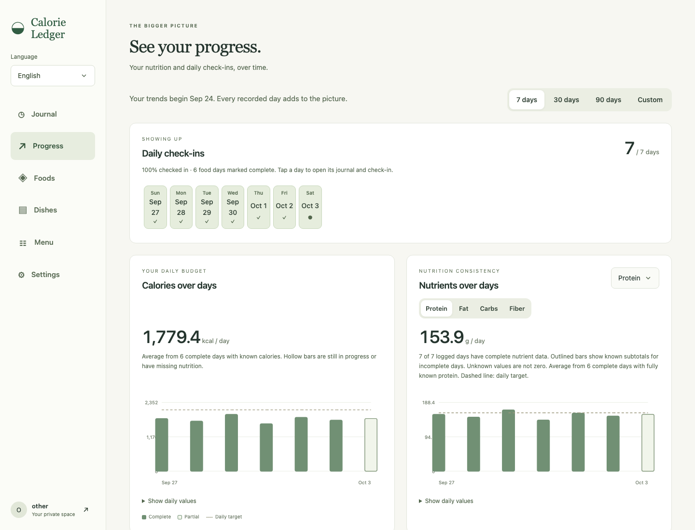
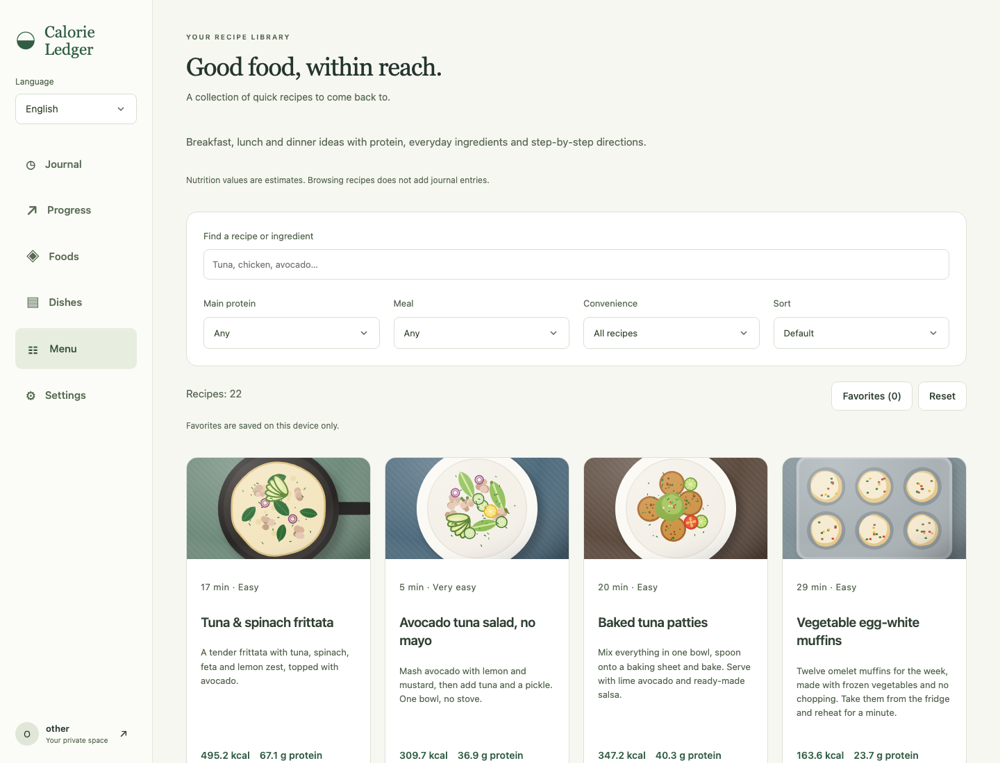
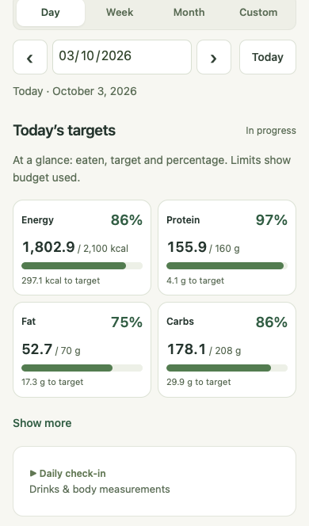
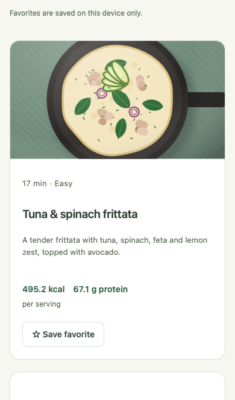
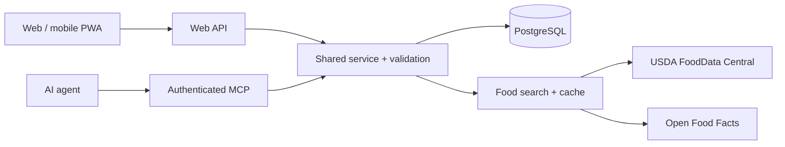

# Calorie Ledger

**A private nutrition journal for everyday tracking—with a web dashboard, mobile Home Screen app, and authenticated tools for AI agents.**

Keep your foods and recipes in one place, understand what contributes to your daily targets, and follow your progress over time. English and Russian are supported throughout the interface; English is the default.

[Open the app](https://calorie-ledger-six.vercel.app/) · [Connect an agent](#connect-an-ai-agent) · [Run locally](#run-locally) · [Technical guide](docs/guide.md)



## What you can do

| Area | Capabilities |
| --- | --- |
| **Journal** | Log foods and dishes; browse a day, week, month, or custom interval; inspect and edit individual entries in a modal. |
| **Daily targets** | See calories and macros against editable goals, expand additional nutrients, and click a target to see which foods contributed. |
| **Foods & dishes** | Search USDA and Open Food Facts, review labels, save portions, and build reusable recipes with serving yields or cooked weights. |
| **Menu** | Browse 22 illustrated recipes, filter and scale them, then map ingredients to saved foods to create a dish. |
| **Progress** | Chart calories, protein, fiber and other recorded nutrients, plus weight, waist, sleep, hydration and daily check-ins. Preset and custom intervals are supported. |
| **Export** | Download all recorded history as CSV tables in a ZIP or a Markdown report, with an AI analysis prompt and completeness information. |
| **AI agents** | Find familiar foods, preview a meal's nutrition without logging it, manage recipes, record meals and check-ins, and retrieve statistics through MCP. |

### Progress and recipe inspiration



<details>
<summary>View the recipe library</summary>



</details>

### On your phone

<table>
  <tr>
    <td></td>
    <td></td>
  </tr>
  <tr><td>Daily targets</td><td>Recipe inspiration</td></tr>
</table>

On iPhone, open the app in Safari → **Share → Add to Home Screen**. Enable **Open as Web App** if offered. The app supports a standalone window and safe-area spacing. An internet connection is required for account data; offline launches show a reconnect page.

*Screenshots captured October 3, 2026 from the current application running locally with illustrative demo records. Desktop: Chromium, 1440 × 1100. Mobile: WebKit with an iPhone 13 viewport, 390 × 664, without Safari chrome. These are actual UI captures, not mockups or personal production logs. Recipe illustrations are part of the app.*

## Nutrition you can inspect

- **Unknown is different from zero.** Missing nutrients remain marked as incomplete. Progress can display known partial totals; visual zero fallbacks do not turn an unrecorded day into a measured zero in exports.
- **Quantities are explicit.** Nutrition is stored per 100 g. Pieces and volume need a saved product-specific conversion; the service rejects ambiguous units.
- **Corrections propagate.** Ordinary linked journal entries recalculate atomically when a source food or dish changes. Legacy snapshots and manually overridden entries retain their values.
- **Retries do not duplicate meals.** Logging requires a stable idempotency key. Reuse it after an uncertain response.
- **Accounts stay separate.** Browser sessions and agent credentials are account-scoped. There is no public signup.

Labels and provider records can still be incomplete or outdated. Review imported values against the actual product. Default goals are editable starting values, not individualized medical advice.

## Connect an AI agent

The MCP endpoint is:

```text
https://calorie-ledger-six.vercel.app/mcp
```

For Claude, add a custom connector with **Sign in now** and **Register automatically**. Leave client credentials blank, sign in with your Calorie Ledger account, and approve access. No custom request header is needed for OAuth.

For clients that support manual bearer authentication, create an agent token in **Settings** and store it in the client's secret store:

```json
{
  "url": "https://calorie-ledger-six.vercel.app/mcp",
  "headers": { "Authorization": "Bearer YOUR_TOKEN" }
}
```

Install the [Calorie Ledger skill](.agents/skills/calorie-ledger/SKILL.md) to give the agent guidance on matching foods, missing quantities, meal previews and daily check-ins. A [Claude-ready skill ZIP](https://calorie-ledger-six.vercel.app/calorie-ledger-skill.zip) is available from the app. The skill supplies instructions; the MCP connector supplies authenticated tools. See the [connection and authentication guide](docs/guide.md#mcp-connection) for installation details, token lifetimes and protocol behavior.

## Run locally

**Requirements:** Node.js 24, npm, and PostgreSQL for persistent storage.

```sh
npm ci
cp .env.example .env.local
```

Set `DATABASE_URL` to a development PostgreSQL database and `APP_URL` to `http://127.0.0.1:3000`. Then initialize the schema:

```sh
node --env-file=.env.local --import tsx scripts/migrate.ts
```

Supply `NEW_USER_PASSWORD` securely through the environment, create an account, and start the app:

```sh
node --env-file=.env.local --import tsx scripts/create-user.ts yourname America/Los_Angeles
node --env-file=.env.local --import tsx server/dev.ts
```

Open **http://127.0.0.1:3000**. Keep development and production databases separate.

For a disposable local preview, `E2E_TEST=1 npm run dev` uses an in-memory PGlite database. Local-only test accounts are defined in [`server/dev.ts`](server/dev.ts). This mode does not require production credentials and is forbidden under `NODE_ENV=production`.

### Checks

```sh
npm run check          # TypeScript, unit/service tests, production build
npm run test:e2e       # Desktop Chromium, mobile Chromium and mobile WebKit
npm run test:coverage  # Coverage report
npm run format:check  # Source formatting
```

Browser tests use disposable data and deterministic provider responses. CI also runs the service suite against PostgreSQL 17. Never point tests at production. See [verification notes](docs/verification.md).

## Architecture

React 19 and Vite power the UI. Express exposes the web API and MCP transport. Shared Zod schemas and a single service layer enforce validation, ownership and nutrition calculations. PostgreSQL stores accounts, products, recipes, journal entries, source dependencies and OAuth state. Production runs on Vercel with Neon PostgreSQL.



| Path | Responsibility |
| --- | --- |
| [`src/App.tsx`](src/App.tsx) | Journal, food and dish management, settings |
| [`src/Progress.tsx`](src/Progress.tsx), [`src/Goals.tsx`](src/Goals.tsx) | Charts, daily targets and check-ins |
| [`src/Menu.tsx`](src/Menu.tsx), [`src/MenuDish.tsx`](src/MenuDish.tsx) | Recipe browsing and dish creation |
| [`src/shared.ts`](src/shared.ts) | Validated web/MCP contracts |
| [`server/service.ts`](server/service.ts), [`server/nutrition.ts`](server/nutrition.ts) | Account-scoped operations and nutrition math |
| [`server/app.ts`](server/app.ts), [`server/auth.ts`](server/auth.ts), [`server/oauth.ts`](server/oauth.ts) | HTTP, MCP, sessions and OAuth |
| [`server/db.ts`](server/db.ts), [`server/search.ts`](server/search.ts) | Database, migrations and food providers |
| [`tests/`](tests/) | Unit, integration and browser checks |
| [`.agents/skills/`](.agents/skills/) | Meal-logging and nutrition-audit workflows |

## Operations and data sources

Production deployment follows successful main-branch CI and uses the exact tested commit. Schema changes are additive; production secrets stay in Vercel and GitHub Actions. See the [technical guide](docs/guide.md#deployment-and-operations) for configuration, user provisioning, password recovery, backups and rollback.

USDA FoodData Central and Open Food Facts supply food lookup data. Imported records retain their source identifiers. An optional `USDA_API_KEY` increases lookup capacity; provider failures leave saved foods and custom products usable. Open Food Facts data is licensed under [ODbL](https://opendatacommons.org/licenses/odbl/1-0/), with individual contents under the [Database Contents License](https://opendatacommons.org/licenses/dbcl/1-0/). See [data sources and limitations](docs/guide.md#data-sources-and-limitations).

For repeatable catalog checks and evidence-backed repairs, use the repository's [nutrition audit skill](.agents/skills/audit-food-nutrition/SKILL.md).

## License

Private application code; all rights reserved. Third-party dependencies and data retain their respective licenses.
